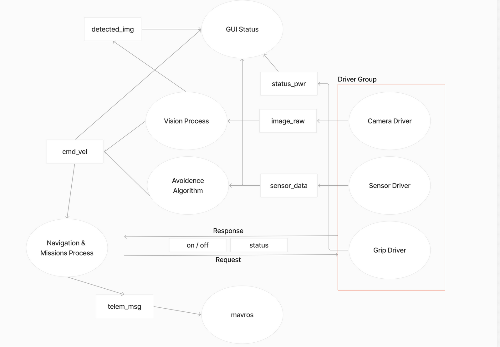

# ROS2 Packages
Hai

## Node Graph


## Installation
Install dulu Linux Ubuntu 22 dan [ROS2](https://docs.ros.org/en/humble/Installation/Ubuntu-Install-Debs.html)

### Install Dependencies
```
$ sudo apt update
$ sudo apt install python3-pip ros-humble-rosbridge-suite ros-humble-web-video-server
$ pip install opencv-python
```

### Buat ws dab Clone Repo
```
$ mkdir your_ws
$ cd your_ws
$ git clone https://github.com/Robotiik-Quadcopter-Team/workshop-ros2.git src
```

### Build
```
$ cd ~/your_ws
$ colcon build
```

## Usage 
Pake launch aja ***d_bringup***
```
$ ros2 launch d_bringup sim_bringup.launch.yaml
```

## Note 
Apa ya